# InformeTarea1

Ejercicios resueltos del Cap1 y Cap2 del libro: "Análisis de Circuitos"-Robbins

1. OBJETIVOS
* Reforzar los conocimientos basicos de matemáticas como por ejemplo la notación cientifica.

CAPITULO I

1-19

20-44

45-58

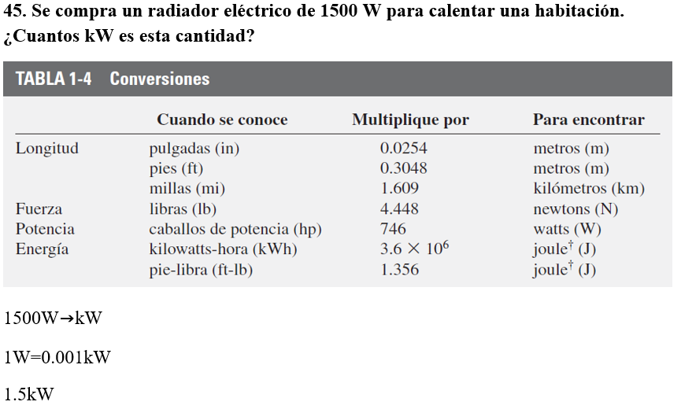
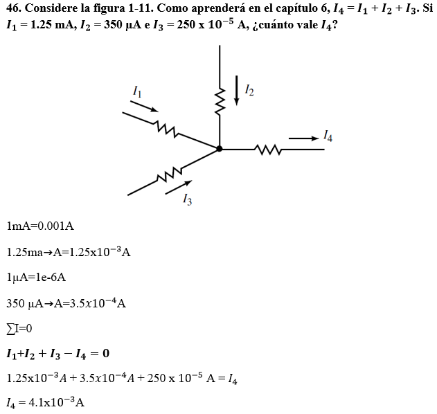
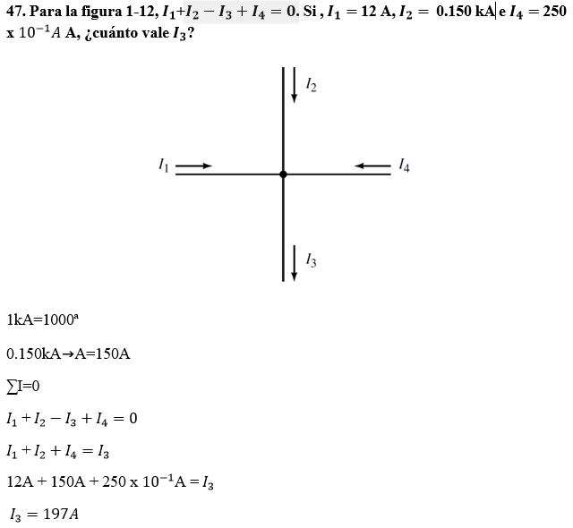
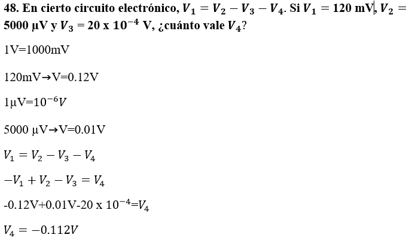
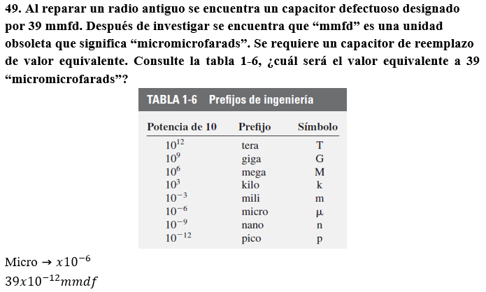
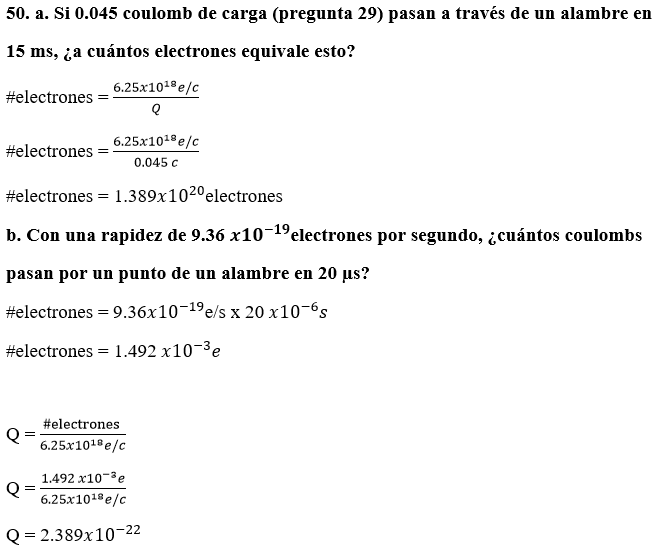
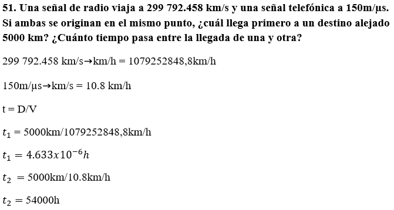
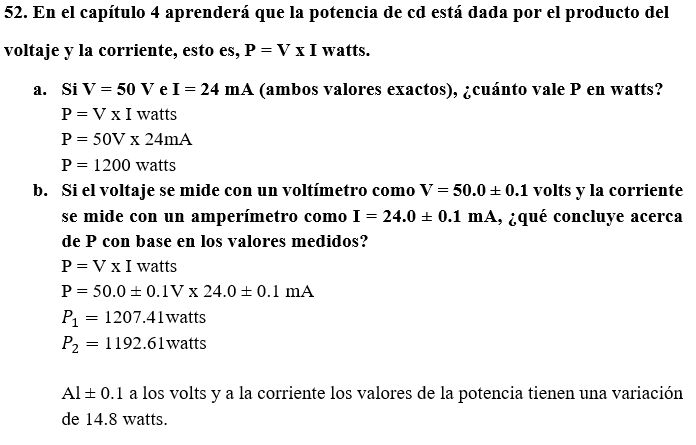
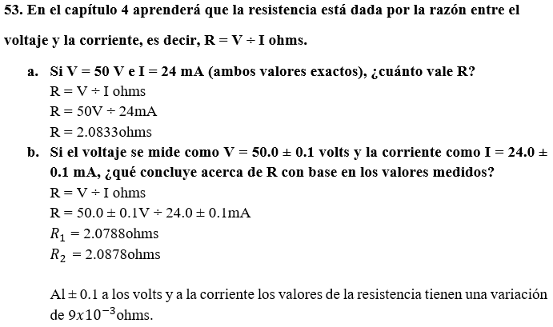
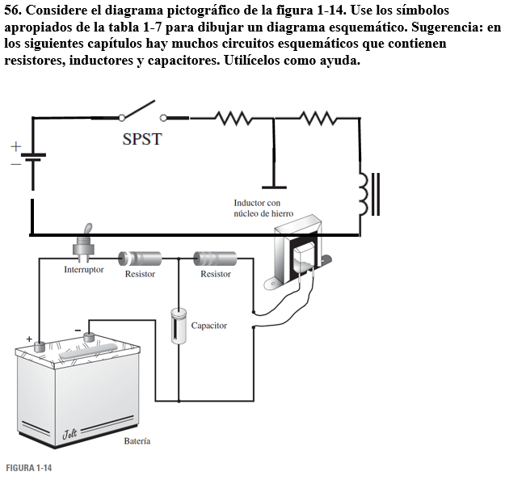
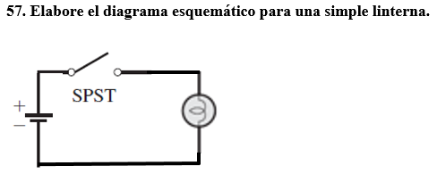

CAPITULO II

1-16

17-24

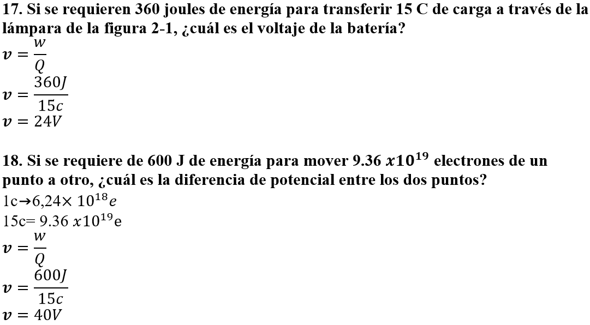
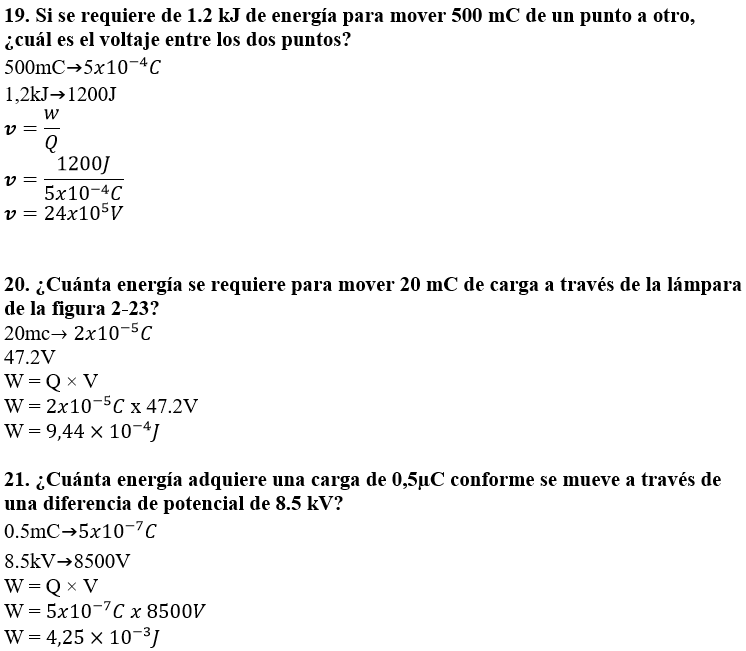
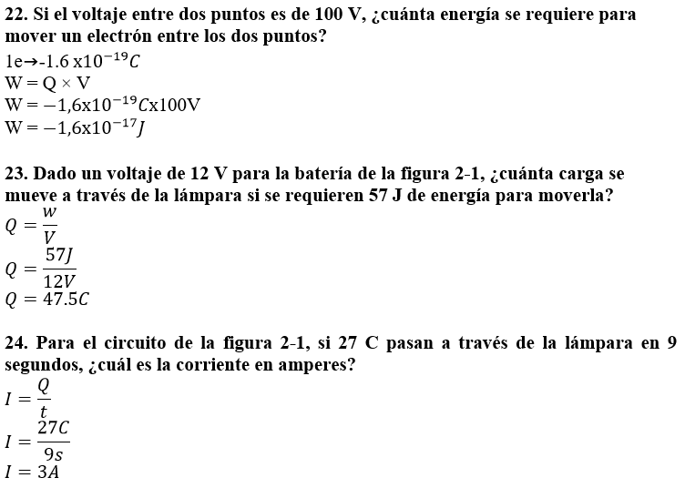

25-resto
