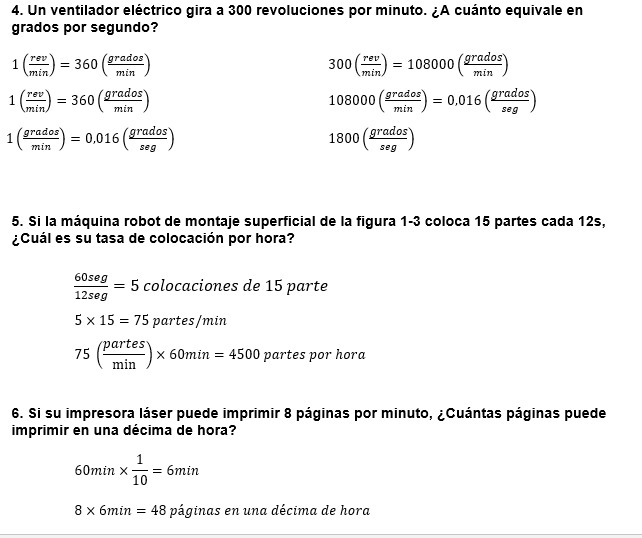
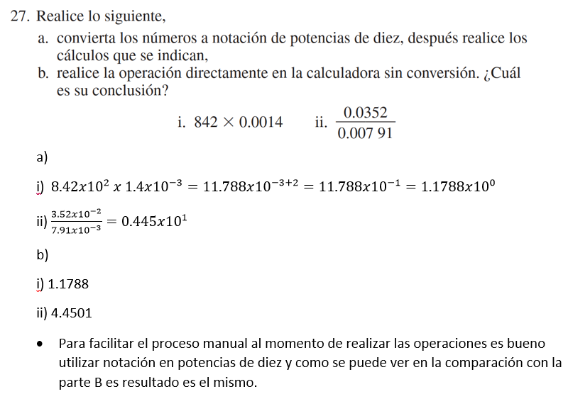

# InformeTarea1

1. OBJETIVOS

-Generales:

* Ser capaces de reconocer las unidades según el SI y sus conversiones mediante el análisis a profundidad de los conceptos fundamentales.

* Conocer los conceptos básicos sobre voltaje y corriente mediante el estudio de la teoría.

-Específicos:

* Estudiar los conceptos de corriente, potencia, conductancia y resistencia, mediante la realizacion de ejercición para entender su relación  y reforzar los conocimientos establecidos en clase.

* Reconocer los ejercicios que requieran uso del Multímetro mediante la lectura del circuito,  para así realizar su respectiva medición.

2. MARCO TEÓRICO:

3. RESOLUCIÓN Y EXPLICACIÓN DE EJERCICIOS:

CAPITULO I

CAPITULO II

4. VDEO:

https://youtu.be/hkFkxWBR3yg

6. CONCLUSIONES:

* Tras aprender terminología y conocimientos base sobre voltaje y corriente somos capaces de aplicarlos sobre circuitos eléctricos.

* Ahora somos capaces de reconocer las unidades el SI y realizar conversiones con facilidad gracias a los conceptos.

* Reconocer los ejercicios que requieran uso del Multímetro mediante la lectura del circuito,  para así realizar su respectiva medición.

7. BIBLIOGRAFÍA:
